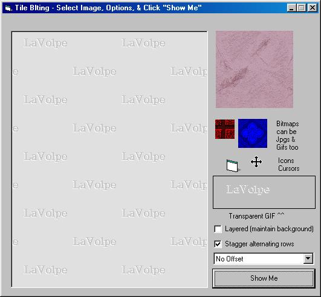



## LaVolpe TileBlt

### Description

A tile blt'er with some added options. Out performs against CreatePatternBrush & may out perform most on PSC. Options include staggered alternating rows, tile over image, & can use transparent gifs, icons & cursors.
 
### More Info
 

             |
---                |---
**Submitted On**   |2005-03-20 22:27:38
**By**             |[LaVolpe](https://github.com/Planet-Source-Code/PSCIndex/blob/master/ByAuthor/lavolpe.md)
**Level**          |Intermediate
**User Rating**    |5.0 (30 globes from 6 users)
**Compatibility**  |VB 6\.0
**Category**       |[Graphics](https://github.com/Planet-Source-Code/PSCIndex/blob/master/ByCategory/graphics__1-46.md)
**World**          |[Visual Basic](https://github.com/Planet-Source-Code/PSCIndex/blob/master/ByWorld/visual-basic.md)
**Archive File**   |[LaVolpe\_Ti1865853202005\.zip](https://github.com/Planet-Source-Code/lavolpe-lavolpe-tileblt__1-59539/archive/master.zip)

